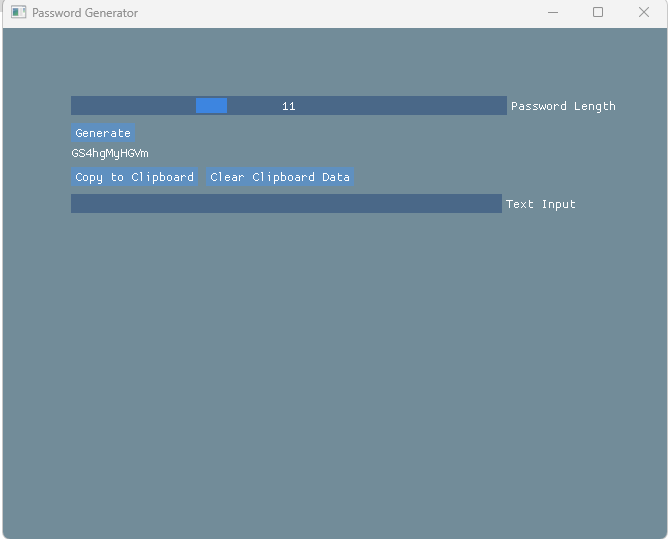
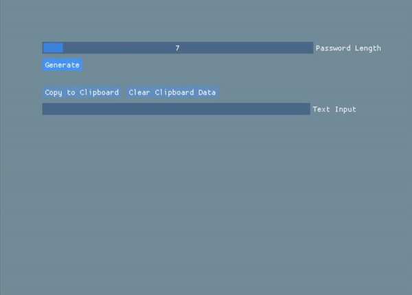

<h1 align="center">Hi 👋, I'm Daniel Jones</h1>
<h3 align="center">I'm a passionate Python and C++ developer</h3>
<h3 align="center">Welcome To my github project!👋</h3>

- 👨‍💻 All of my projects are available at [https://github.com/DanielJones02](https://github.com/DanielJones02)

# Installation and Usage

> [!IMPORTANT]
> I am very beginner when making GUIs. Im also fairly new to C++ (as of this momment 13/10/23)

 - clone the repository `git clone https://github.com/DanielJones02/Password-Generator` or download the compiled exe (GUI or Terminal)

 - Now run compile.bat to compile the console version

 - OR

 - Open /ui and open the project in visual studio then build the exe (Release, x86)

# Previews

# TODO:

 - [x] GUI (ImGui)

 - [x] Clipboard Copy button
    
 - [x] Add Clipboard clear button (GUI)

 - [ ] Save passwords in an encryped file (Console & GUI)
       
 - [ ] Make the GUI neater and overall better

<h3 align="left">Connect with me:</h3>

<h3 align="left">Languages and Tools:</h3>

      

